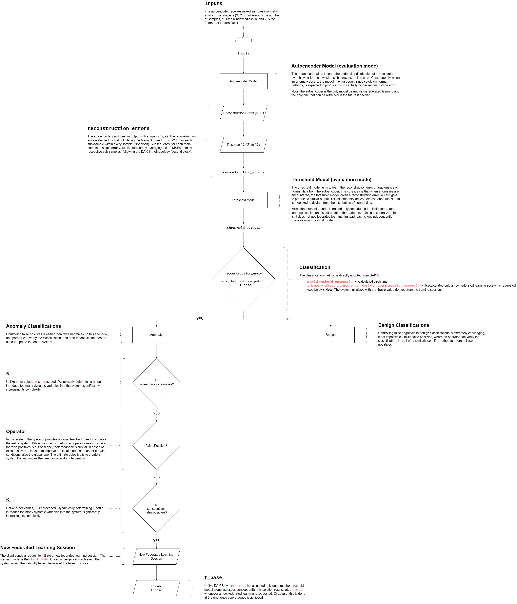

# Table of Contents

- [Training Pipeline](#training-pipeline)
- [Deployment Pipeline](#deployment-pipeline)
  - [Inputs](#inputs)
  - [Autoencoder Model](#autoencoder-model)
  - [Reconstruction Errors](#reconstruction-errors)
  - [Threshold Model](#threshold-model)
  - [Classification](#classification)
    - [Benign Classifications](#benign-classifications)
    - [Anomaly Classifications](#anomaly-classifications)
      - [`N`](#n)
      - [Operator](#operator)
      - [`K`](#k)
      - [New Federated Learning Session](#new-federated-learning-session)
      - [`t_base`](#t_base)
  - [Visual Representation](#visual-representation)

# Training Pipeline

# Deployment Pipeline

## Inputs

The autoencoder receives mixed samples (normal + attack). The shape is `(X, Y, Z)`, where `X` is the number of samples, `Y` is the window size (10), and `Z` is the number of features (51).

## Autoencoder Model

The autoencoder aims to learn the underlying distribution of normal data by achieving for the lowest possible reconstruction error. Consequently, when an anomaly occurs, the model, having been trained solely on normal patterns, is expected to produce a substantially higher recontrsuction error.

> [!NOTE]
> The autoencoder is the only model trained using federated learning and the only one that can be retrained in the future if needed.

## Reconstruction Errors

The autoencoder produces an output with shape `(X, Y, Z)`. The reconstruction error is derived by first calculating the Mean Squared Error (MSE) for each sub-sample within every sample (first block). Subsequently, for each main sample, a single error value is obtained by averaging the 10 MSEs from its respective sub-samples, following the DAICS methodology (second block).

## Threshold Model

The threshold model aims to learn the reconstruction error characteristics of normal data from the autoencoder. The code idea is that when anomalies are encountered, the threshold model, given a reconstruction error, will struggle to produce a similar output. This discrepancy arises because anomalous data is theorized to deviate from the distribution of normal data.

> [!NOTE]
> The threshold model is trained only once during the initial federated learning session and is not updated thereafter. Its training is centralized; that is, it does not use federated learning. Instead, each client independently trains its own threshold model.

## Classification

The classification method is directly adopted from DAICS.

- `max(threshold_outputs)`: Calculated each time.
- `t_base = μ(reconstruction_errors) + σ(reconstruction_errors)`: Recalculated only when a new federated learning session is requested.

> [!NOTE]
> The system initializes with a `t_base` value derived from the training session.

### Benign Classifications

Controlling false negatives in benign classifications is extremely challengin, if not impossible. Unlike false positives, where an operator can verify the classification, there isn't a similarly specific method to address false negatives.

### Anomaly Classifications

Controlling false positives is easier than false negatives. In this scenario, an operator can verify the classification, and their feedback can then be used to update the entire system.

#### `N`

Unlike other values, `N` is hardcoded. Dynamically determining `N` could introduce too many dynamic variables into the system, significantly increasing its complexity.

#### Operator

In this system, the operator provides optional feedback used to improve the entire system. While the specific method an operator uses to check for false positives is out of scope, their feedback is crucial: in cases of false positives, it is used to improve the local model and, under certain conditions, also the global one. The ultimate objective is to create a system that minimizes the need for operator intervention.

#### `K`

Unlike other values, `K` is hardcoded. Dynamically determining `K` could introduce too many dynamic variables into the system, significantly increasing its complexity.

#### New Federated Learning Session

The client sends a request to initiate a new federated learning session. The starting model is the `global_model`. Once convergence is achieved, the system would theoretically have internalized the false positives.

#### `t_base`

Unlike DAICS, where `t_base` is calculated only once (as the threshold model alone assesses concept drift), this solution recalculates `t_base` whenever a new federated learning session is requested. Of course, this is done at the end, once convergence is achieved.

## Visual Representation

<picture>
    <source media="(prefers-color-scheme: dark)" srcset="pipeline/v2/pipeline-dark.png">
    
</picture>